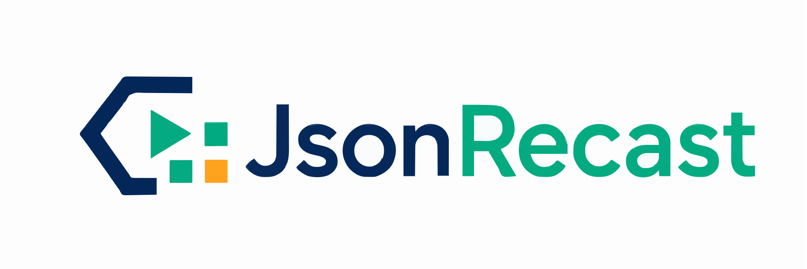

# JsonRecast

<p align="center">
    <picture>
        <source media="(prefers-color-scheme: dark)" srcset="docs/assets/jsonrecast-dark-mode.svg">
        <source media="(prefers-color-scheme: light)" srcset="docs/assets/jsonrecast-light-mode.svg">
        
    </picture>
</p>

A PHP JSON parser that turns JSON into an editable AST, supports visitor-based traversal, and prints changes back while preserving the original formatting.

Inspired by [PHP-Parser](https://github.com/nikic/PHP-Parser/), built for tools that need to modify JSON files safely.

JsonRecast is optimized for safely changing files. It keeps the original structure and formatting where possible, so automated tools can modify JSON without creating noisy diffs.

The AST stays clean. Change metadata lives in the traversal result.

[](https://github.com/boundwize/jsonrecast/releases)
[](https://github.com/boundwize/jsonrecast/actions/workflows/ci.yml)
[](https://codecov.io/gh/boundwize/jsonrecast)
[](https://github.com/phpstan/phpstan)
[](https://packagist.org/packages/boundwize/jsonrecast)


## Installation

```bash
composer require boundwize/jsonrecast
```

## Features

* Parse JSON into an AST
* Traverse and modify nodes with `NodeJsonTraverser`
* Create visitors with `NodeJsonVisitor`
* Access runtime traversal context with `NodeJsonPath`
* Replace, add, and remove JSON data
* Preserve original formatting when printing modified JSON
* Keep number representations like `1`, `1.0`, and `1e0`
* Supports recursive objects and arrays
* Tracks changes outside the AST
* Designed for tooling, config updates, and automated refactoring

## Example

Given this JSON:

```json
{
    "name": "acme/demo",
    "autoload": {
        "psr-4": {
            "App\\": "app/"
        }
    },
    "autoload-dev": {
        "classmap": [
            "tests/Fixtures/App"
        ]
    },
    "minimum-stability": "dev"
}
```

You can edit `name`, add a PSR-4 namespace, and delete stale object or array data in one traversal:

```php
use Boundwize\JsonRecast\JsonRecast;
use Boundwize\JsonRecast\Node\ArrayNode;
use Boundwize\JsonRecast\Node\NodeJson;
use Boundwize\JsonRecast\Node\ObjectItemNode;
use Boundwize\JsonRecast\Node\ObjectNode;
use Boundwize\JsonRecast\Node\StringNode;
use Boundwize\JsonRecast\NodeVisitor\NodeJsonPath;
use Boundwize\JsonRecast\NodeVisitor\NodeJsonRemoval;
use Boundwize\JsonRecast\NodeVisitor\NodeJsonVisitorAbstract;

$document = JsonRecast::parse($json);

$result = JsonRecast::traverse($document, new class extends NodeJsonVisitorAbstract {
    public function enterNode(NodeJson $node, NodeJsonPath $path): null|NodeJson|NodeJsonRemoval
    {
        if (
            $node instanceof ObjectItemNode
            && $path->isRoot()
        ) {
            if ($node->key->value === 'name') {
                $node->value = new StringNode('boundwize/jsonrecast');

                return $node;
            }

            if ($node->key->value === 'minimum-stability') {
                return NodeJsonRemoval::remove();
            }
        }

        if ($node instanceof ObjectNode && $path->matches(['autoload', 'psr-4'])) {
            $node->set('Boundwize\\JsonRecast\\', new StringNode('src/'));

            return $node;
        }

        if ($node instanceof ArrayNode && $path->matches(['autoload-dev', 'classmap'])) {
            $removed = false;

            foreach ($node->items as $index => $item) {
                if (! $item->value instanceof StringNode || $item->value->value !== 'tests/Fixtures/App') {
                    continue;
                }

                $node->removeAt($index);
                $removed = true;
            }

            return $removed ? $node : null;
        }

        return null;
    }
});

echo JsonRecast::print($result);
```

The printed JSON keeps the surrounding formatting and only rewrites the changed pieces:

```json
{
    "name": "boundwize/jsonrecast",
    "autoload": {
        "psr-4": {
            "App\\": "app/",
            "Boundwize\\JsonRecast\\": "src/"
        }
    },
    "autoload-dev": {
        "classmap": [
        ]
    }
}
```

Use `leaveNode()` when a parent decision depends on child nodes that may already have changed. For example, after the `classmap` array item is removed, you can remove the now-empty root `autoload-dev` item:

```php
public function leaveNode(NodeJson $node, NodeJsonPath $path): ?NodeJsonRemoval
{
    if (
        ! $node instanceof ObjectItemNode
        || ! $path->isRoot()
        || $node->key->value !== 'autoload-dev'
        || ! $node->value instanceof ObjectNode
    ) {
        return null;
    }

    $classmapItem = $node->value->get('classmap');

    if (
        ! $classmapItem instanceof ObjectItemNode
        || ! $classmapItem->value instanceof ArrayNode
        || $classmapItem->value->items !== []
    ) {
        return null;
    }

    return NodeJsonRemoval::remove();
}
```

With that hook added, the printed JSON becomes:

```json
{
    "name": "boundwize/jsonrecast",
    "autoload": {
        "psr-4": {
            "App\\": "app/",
            "Boundwize\\JsonRecast\\": "src/"
        }
    }
}
```
